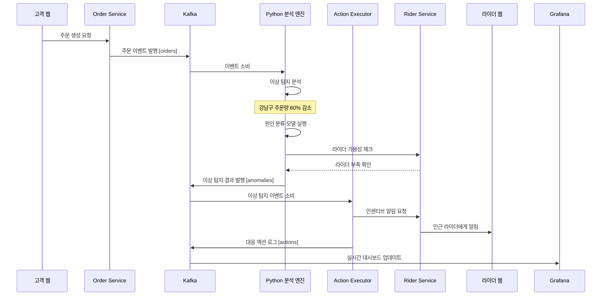
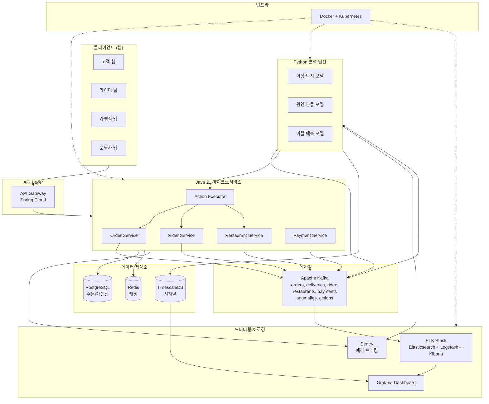

# OrderSense: 배달 플랫폼 지능형 운영 시스템

## 프로젝트 개요

배달 플랫폼의 비즈니스 메트릭을 실시간으로 모니터링하고, 이상을 탐지하며, 원인을 분석하여 자동으로 대응하는 지능형 운영 시스템

---

## 비즈니스 메트릭 및 이상 탐지 대상

### 주문 관련
- 특정 지역/시간대 주문량 급감 또는 급증
- 주문 취소율 변화
- 평균 주문 금액 이상 패턴

### 배달 관련
- 배달 소요 시간 증가
- 특정 라이더/지역 배달 실패율
- 라이더 가용성 부족

### 가맹점 관련
- 특정 음식점 주문 거부율 급증
- 음식 준비 시간 지연
- 가맹점 시스템 응답 지연

### 결제 관련
- 결제 실패율 증가
- 환불 요청 급증
- 특정 결제 수단 오류

---

## 핵심 시나리오

### 시나리오 1: 특정 지역 주문량 급감

1. Python이 강남구 주문량 60% 감소 탐지
2. 원인 분류 모델 실행:
    - 라이더 부족? → 라이더 API 헬스체크
    - 가맹점 시스템 장애? → 가맹점 API 헬스체크
    - 날씨/교통 이슈? → 외부 API 확인
3. 라이더 부족 확인 시 → 인근 지역 라이더에게 인센티브 알림 자동 발송
4. 가맹점 시스템 장애 시 → 해당 지역 가맹점 일시 비활성화 + 운영팀 알림

### 시나리오 2: 배달 시간 지연 패턴

1. Python이 평균 배달 시간 25분 → 45분 증가 탐지
2. 원인 분석:
    - 특정 음식점 준비 시간 지연 → 해당 음식점에 경고 알림
    - 교통 체증 → 예상 배달 시간 자동 조정
    - 라이더 경로 최적화 문제 → 경로 알고리즘 재계산 트리거
3. 고객에게 자동으로 지연 안내 + 보상 쿠폰 발송

### 시나리오 3: 고객 이탈 예측

1. Python이 최근 주문 빈도 감소 고객 세그먼트 식별
2. 이탈 확률 70% 이상 고객에게 맞춤 프로모션 자동 발송
3. 재주문율 추적 및 효과 분석

### 시나리오 4: 가맹점 주문 거부율 급증

1. 특정 음식점 주문 거부율 5% → 30% 증가 탐지
2. 원인 분석: 재료 소진? 인력 부족? 시스템 오류?
3. 자동 대응: 해당 음식점 노출 순위 하락 + 운영팀 확인 요청

---

## 시스템 구성

### Java (Spring Boot)
- 주문 접수 API
- 라이더 매칭 서비스
- 가맹점 관리 서비스
- 결제 처리
- 자동 대응 액션 실행기

### Kafka 토픽
- `orders` - 주문 이벤트
- `deliveries` - 배달 상태
- `riders` - 라이더 위치/상태
- `restaurants` - 가맹점 상태
- `payments` - 결제 이벤트
- `anomalies` - 이상 탐지 결과
- `actions` - 자동 대응 실행 로그

### Python 분석 모듈
- 시계열 이상 탐지 (주문량, 배달 시간)
- 원인 분류 모델
- 고객 이탈 예측
- 수요 예측 (피크 시간 대비)

### Grafana 대시보드 구성
- 실시간 주문 현황 (지역별, 시간대별)
- 배달 성공률 및 평균 소요 시간
- 이상 탐지 알림 히스토리
- 자동 대응 실행 결과
- 고객 만족도 지표

---

## 기술 스택

| 기술 | 버전 | 역할 |
|------|------|------|
| Java | 21 (LTS) | 메인 웹서비스, 비즈니스 로직 |
| Spring Boot | 3.x | 마이크로서비스 프레임워크 |
| Python | 3.11 | ML 모델 개발 및 서빙 |
| Apache Kafka | 3.x | 이벤트 스트리밍 |
| Elasticsearch | 8.x | 로그 저장 및 검색 |
| Logstash | 8.x | 로그 수집 파이프라인 |
| Kibana | 8.x | 로그 시각화 |
| Grafana | 10.x | 대시보드 및 메트릭 시각화 |
| Sentry | - | 에러 트래킹 |
| PostgreSQL | - | 주문/가맹점 데이터 저장 |
| Redis | - | 캐싱 |
| Docker | - | 컨테이너화 |
| Kubernetes | - | 오케스트레이션 |

