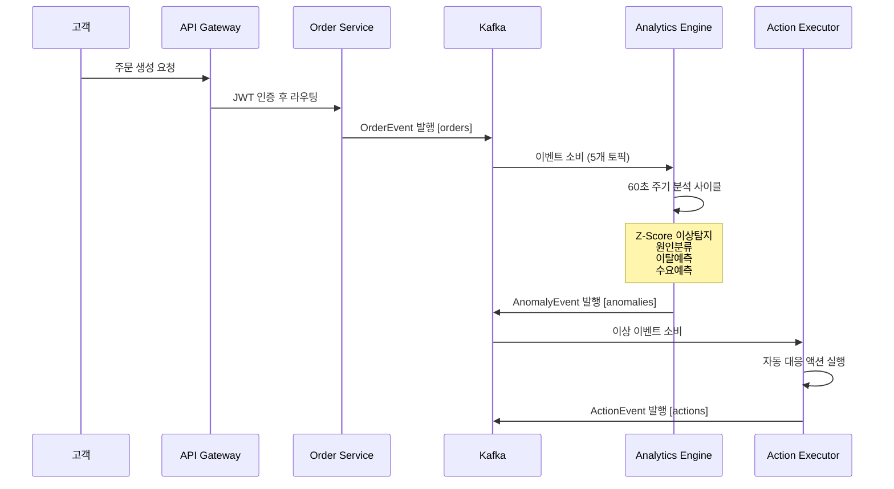

# OrderSense

배달 플랫폼의 비즈니스 메트릭을 실시간으로 모니터링하고, 이상을 탐지하며, 원인을 분석하여 자동으로 대응하는 지능형 운영 시스템

## 목차

- [아키텍처](#아키텍처)
- [기술 스택](#기술-스택)
- [마이크로서비스 구성](#마이크로서비스-구성)
- [이상탐지 엔진](#이상탐지-엔진-analytics-engine)
- [대시보드](#대시보드)
- [Kafka 이벤트 아키텍처](#kafka-이벤트-아키텍처)
- [모니터링 및 옵저버빌리티](#모니터링-및-옵저버빌리티)
- [실행 방법](#실행-방법)
- [API 명세](#api-명세)

---

## 아키텍처

```
                          ┌─────────────────────────────────┐
                          │        Dashboard (Next.js)      │
                          │          :3001                  │
                          └────────────┬────────────────────┘
                                       │
                          ┌────────────▼────────────────────┐
                          │     API Gateway (SCG) :8080     │
                          │    JWT 인증 / 라우팅 / CORS     │
                          └────────────┬────────────────────┘
                                       │
          ┌──────────┬─────────┬───────┴────┬──────────┐
          ▼          ▼         ▼            ▼          ▼
   ┌───────────┐┌────────┐┌──────────┐┌─────────┐┌──────────┐
   │  Order    ││ Rider  ││Restaurant││ Payment ││ Action   │
   │  Service  ││ Service││ Service  ││ Service ││ Executor │
   │  :8081    ││ :8082  ││ :8083    ││ :8084   ││ :8085    │
   └─────┬─────┘└───┬────┘└────┬─────┘└────┬────┘└────┬─────┘
         │          │          │           │          │
         └──────────┴──────────┴─────┬─────┴──────────┘
                                     │
                          ┌──────────▼──────────┐
                          │   Apache Kafka      │
                          │   (KRaft mode)      │
                          │   :9092             │
                          └──────────┬──────────┘
                                     │
                    ┌────────────────┬┴───────────────┐
                    ▼                ▼                 ▼
         ┌──────────────┐ ┌──────────────┐  ┌──────────────┐
         │  Analytics   │ │  Logstash    │  │  Kafka UI    │
         │  Engine (Py) │ │  → ES → Kib  │  │  :8090       │
         │  :8086       │ │              │  └──────────────┘
         └──────────────┘ └──────────────┘

    ┌───────────┐  ┌───────────┐  ┌──────────────────────┐
    │ PostgreSQL│  │   Redis   │  │ Prometheus → Grafana  │
    │ :5432     │  │   :6379   │  │ :9090        :3000    │
    └───────────┘  └───────────┘  └──────────────────────┘
```

### 핵심 데이터 흐름


```mermaid
sequenceDiagram
    participant C as 고객
    participant GW as API Gateway
    participant OS as Order Service
    participant K as Kafka
    participant AE as Analytics Engine
    participant AX as Action Executor

    C->>GW: 주문 생성 요청
    GW->>OS: JWT 인증 후 라우팅
    OS->>K: OrderEvent 발행 [orders]
    K->>AE: 이벤트 소비 (5개 토픽)
    AE->>AE: 60초 주기 분석 사이클
    Note over AE: Z-Score 이상탐지<br/>원인분류<br/>이탈예측<br/>수요예측
    AE->>K: AnomalyEvent 발행 [anomalies]
    K->>AX: 이상 이벤트 소비
    AX->>AX: 자동 대응 액션 실행
    AX->>K: ActionEvent 발행 [actions]
```

---

## 기술 스택

### Backend

| 기술 | 버전 | 역할 |
|------|------|------|
| Java | 21 (LTS) | 마이크로서비스 런타임 |
| Spring Boot | 3.5.7 | 웹 프레임워크 |
| Spring Cloud Gateway | - | API Gateway |
| Spring Kafka | - | Kafka 연동 |
| Spring Security + JWT (JJWT) | 0.12.6 | 인증/인가 |
| Spring Data JPA / Redis | - | 데이터 액세스 |
| MapStruct | 1.5.5 | DTO 매핑 |
| SpringDoc OpenAPI | 2.8.14 | API 문서 자동 생성 |

### Analytics Engine

| 기술 | 버전 | 역할 |
|------|------|------|
| Python | 3.11+ | 분석 엔진 런타임 |
| FastAPI | 0.115.6 | REST API 프레임워크 |
| confluent-kafka | 2.6.1 | Kafka Consumer/Producer |
| NumPy | 2.2.1 | 수치 연산 (Z-Score 등) |
| pandas | 2.2.3 | 데이터 처리 |
| scikit-learn | 1.6.1 | ML 유틸리티 |
| APScheduler | 3.10.4 | 주기적 분석 스케줄링 |
| Pydantic | 2.10.4 | 데이터 모델 검증 |

### Frontend

| 기술 | 버전 | 역할 |
|------|------|------|
| Next.js | 14 | React 프레임워크 (App Router) |
| TypeScript | 5.4 | 타입 안전성 |
| SWR | 2.2 | 실시간 데이터 페칭 (polling) |
| Recharts | 2.12 | 차트 시각화 |
| Tailwind CSS | 3.4 | UI 스타일링 |

### Infrastructure

| 기술 | 버전 | 역할 |
|------|------|------|
| Apache Kafka | 7.5.0 (CP) | 이벤트 스트리밍 (KRaft 모드) |
| PostgreSQL | 16 | 관계형 데이터베이스 |
| Redis | 7 | 캐싱 |
| Elasticsearch | 8.11.0 | 로그 저장/검색 |
| Logstash | 8.11.0 | Kafka → ES 파이프라인 |
| Kibana | 8.11.0 | 로그 시각화 |
| Prometheus | 2.47.0 | 메트릭 수집 |
| Grafana | 10.2.0 | 메트릭 대시보드 |
| Sentry | 8.22.0 | 에러 트래킹 |
| Docker Compose | - | 컨테이너 오케스트레이션 |

---

## 마이크로서비스 구성

### Order Service `:8081`

주문 생명주기 관리 및 인증을 담당하는 핵심 서비스

- 주문 CRUD 및 상태 관리
- 고객 회원가입/로그인 (JWT 발급)
- 주문 상태 흐름: `PENDING` → `ACCEPTED` → `PREPARING` → `READY` → `PICKED_UP` → `DELIVERING` → `DELIVERED`
- Kafka Consumer로 배달/가맹점/결제 이벤트 수신하여 주문 상태 자동 업데이트

### Rider Service `:8082`

라이더 관리 및 실시간 위치 추적

- 라이더 등록 및 상태 관리 (`AVAILABLE` / `BUSY` / `OFFLINE`)
- WebSocket 기반 실시간 위치 업데이트
- 지역별 라이더 가용성 조회

### Restaurant Service `:8083`

가맹점 및 메뉴 관리

- 가맹점 CRUD 및 상태 관리 (`OPEN` / `CLOSED` / `SUSPENDED`)
- 메뉴 아이템 관리
- Quartz 스케줄러 기반 일일 상태 점검

### Payment Service `:8084`

결제 처리 및 트랜잭션 관리

- 결제 처리 (`PENDING` → `COMPLETED` / `FAILED`)
- 환불 처리 (`REFUNDED`)
- 결제 실패 사유 기록

### Action Executor Service `:8085`

이상탐지 결과에 대한 자동 대응 실행

- Kafka `anomalies` 토픽 구독
- 이상 유형별 자동 대응 액션 실행
- 실행 결과 로깅 (`SUCCESS` / `FAILED` / `PARTIAL`)
- AOP 기반 액션 로깅

### API Gateway `:8080`

Spring Cloud Gateway 기반 진입점

- JWT 인증 필터 (`JwtAuthGatewayFilter`)
- 서비스 라우팅

| 경로 | 대상 서비스 |
|------|-----------|
| `/api/auth/**` | Order Service |
| `/api/orders/**`, `/api/customers/**` | Order Service |
| `/api/riders/**` | Rider Service |
| `/api/restaurants/**`, `/api/menus/**` | Restaurant Service |
| `/api/payments/**` | Payment Service |
| `/api/actions/**` | Action Executor Service |
| `/api/analytics/**` | Analytics Engine |

---

## 이상탐지 엔진 (Analytics Engine)

Python 기반 실시간 분석 엔진. Kafka에서 이벤트를 소비하고, 60초 주기로 통계 기반 이상탐지를 수행합니다.

### 분석 파이프라인

```
Kafka (5개 토픽) → KafkaEventConsumer (daemon thread)
                        │
                        ▼
                   EventStore (인메모리, thread-safe)
                        │
                        ▼ (60초 주기 BackgroundScheduler)
              ┌─────────┼─────────┐
              ▼         ▼         ▼
        Anomaly    RootCause   Churn
        Detector   Classifier  Predictor
              │         │         │
              ▼         ▼         ▼
        AnomalyEvent → Kafka [anomalies] 토픽
                     → REST API → Dashboard
```

### 1. 주문량 이상탐지 — Z-Score

과거 5시간의 지역별 주문량 분포를 기반으로 현재 시간대의 주문량이 통계적으로 이례적인지 판별합니다.

```
Z = (X - μ) / σ

X : 현재 시간 주문량
μ : 과거 5시간 주문량 평균
σ : 과거 5시간 주문량 표준편차
```

| 조건 | 판정 |
|------|------|
| Z < -2.0 | **ORDER_DROP** (주문량 급감) |
| Z > 2.0 | ORDER_SURGE 로그 기록 |
| 현재 0건 & 과거 평균 > 0 | ORDER_DROP (severity 0.8) |

**심각도 계산:** `severity = min(1.0, abs(z_score) / 4)`

> 예시: 과거 5시간 `[100, 95, 110, 105, 90]` → μ=100, σ=7.07
> 현재 70건 → Z = (70-100)/7.07 = **-4.24** → 이상 판정, severity = 1.0

### 2. 배달 지연 탐지 — 평균 비율 비교

최근 1시간 평균 배달 시간과 과거 6시간 평균을 비교합니다.

```
ratio = 최근 1시간 평균 배달시간 / 과거 6시간 평균 배달시간

ratio > 1.5 → DELIVERY_DELAY 이상 판정
```

**심각도 계산:** `severity = min(1.0, (ratio - 1) / 2)`

> 예시: 평소 30분 → 현재 50분 → ratio = 1.67 → 이상 판정, severity = 0.335

### 3. 결제 실패 급증 탐지 — 임계값 기반

```
최근 1시간 결제 실패 건수 ≥ 5 → 이상 판정
```

**심각도 계산:** `severity = min(1.0, failure_count / 20)`

### 4. 원인 분류 — 규칙 기반 분류기 (RootCauseClassifier)

이상이 탐지된 지역에 대해 원인을 분류합니다.

| 우선순위 | 조건 | 분류 |
|---------|------|------|
| 1 | 가용 라이더 < 3명 | `RIDER_SHORTAGE` |
| 2 | 주문 거부율 > 20% | `HIGH_REJECTION_RATE` |
| 3 | 결제 실패 > 5건/시간 | `PAYMENT_FAILURE` |
| - | 해당 없음 | `UNKNOWN` |

복합 원인의 경우 `allCauses` 배열로 모든 원인을 함께 반환합니다.

### 5. 고객 이탈 예측 — 주문 빈도 감소율 (ChurnPredictor)

```
frequency_drop = 1 - (최근 12시간 주문수 / 이전 12시간 주문수)

조건: 주문 이력 3건 이상 & frequency_drop ≥ 0.5 → 이탈 위험
```

**이상 발행 조건:** 고위험 고객(risk_score ≥ 0.7)이 1명 이상이고 전체 위험 고객이 3명 이상일 때 `CUSTOMER_CHURN` 이벤트를 Kafka로 발행합니다.

### 6. 수요 예측 — 가중 이동평균 (DemandForecaster)

```
가중치: [0.4, 0.3, 0.15, 0.1, 0.05]  (최근 → 과거)

prediction = Weighted Moving Average × 추세 보정 계수
```

| 추세 판별 | 조건 (현재/3시간전 비율) | 보정 계수 |
|----------|----------------------|----------|
| increasing | ratio > 1.15 | × 1.1 |
| decreasing | ratio < 0.85 | × 0.9 |
| stable | 그 외 | × 1.0 |

**신뢰도:** `confidence = max(0.1, min(0.95, 1.0 - CV))` (CV = 변동계수, 데이터 변동이 적을수록 높음)

### Severity(심각도) 설계

모든 이상 이벤트는 0.0 ~ 1.0 스케일의 심각도를 포함합니다.

| 탐지 유형 | 수식 | 최대 심각도 도달 조건 |
|----------|------|-------------------|
| 주문량 급감 | `abs(z) / 4` | Z-Score ≥ 4 |
| 배달 지연 | `(ratio-1) / 2` | 3배 이상 지연 |
| 결제 실패 | `count / 20` | 20건 이상 |
| 고객 이탈 | `frequency_drop` | 100% 감소 |

### 설정값 (config.py)

```python
ANALYSIS_INTERVAL_SECONDS = 60      # 분석 주기
EVENT_RETENTION_HOURS = 24          # 이벤트 보관 시간
ANOMALY_Z_SCORE_THRESHOLD = 2.0     # Z-Score 임계값
DELIVERY_DELAY_THRESHOLD = 1.5      # 배달 지연 비율 임계값
CHURN_FREQUENCY_DROP = 0.5          # 이탈 판별 빈도 감소율
REJECTION_RATE_THRESHOLD = 0.2      # 가맹점 거부율 임계값
```

---

## 화면


## Kafka 이벤트 아키텍처

### 토픽 구성

| 토픽 | Producer | Consumer | 이벤트 타입 |
|------|----------|----------|-----------|
| `orders` | Order Service | Restaurant, Rider, Payment, Analytics | ORDER_CREATED, ORDER_CANCELLED, ORDER_STATUS_CHANGED |
| `deliveries` | Order, Rider Service | Order, Analytics | RIDER_ASSIGNED, RIDER_PICKED_UP, DELIVERY_STARTED, DELIVERY_COMPLETED |
| `riders` | Rider Service | Analytics | LOCATION_UPDATED, 상태 변경 |
| `restaurants` | Restaurant Service | Order, Analytics | ORDER_ACCEPTED, ORDER_REJECTED, ORDER_PREPARING, ORDER_READY |
| `payments` | Payment Service | Order, Analytics | PAYMENT_COMPLETED, PAYMENT_FAILED, PAYMENT_REFUNDED |
| `anomalies` | Analytics Engine | Action Executor, Logstash | ORDER_DROP, DELIVERY_DELAY, CUSTOMER_CHURN, REJECTION_SPIKE |
| `actions` | Action Executor | Logstash | 액션 실행 결과 |

### 역직렬화 설정

모든 Java 서비스 Consumer에 `ErrorHandlingDeserializer`를 적용하여 역직렬화 실패 시에도 서비스가 중단되지 않도록 구성했습니다.

```yaml
consumer:
  key-deserializer: org.springframework.kafka.support.serializer.ErrorHandlingDeserializer
  value-deserializer: org.springframework.kafka.support.serializer.ErrorHandlingDeserializer
  properties:
    spring.deserializer.key.delegate.class: StringDeserializer
    spring.deserializer.value.delegate.class: JsonDeserializer
    spring.json.use.type.headers: false
    spring.json.value.default.type: java.util.HashMap
```

---

## 모니터링 및 옵저버빌리티

### ELK Stack (로그 중앙화)

```
Kafka (7개 토픽) → Logstash → Elasticsearch → Kibana
                                인덱스: ordersense-{토픽명}-{YYYY.MM}
```

### Prometheus + Grafana (메트릭)

- 15초 간격으로 각 서비스의 `/actuator/prometheus` 엔드포인트 스크래핑
- Grafana에 Prometheus 데이터소스 자동 프로비저닝

### Sentry (에러 트래킹)

- 모든 Java 서비스에 Sentry SDK 통합
- 100% 트레이스 샘플링

---

### 포트 매핑

| 포트 | 서비스 |
|------|--------|
| 3000 | Grafana (admin / admin123) |
| 3001 | Dashboard (Next.js) |
| 5432 | PostgreSQL (ordersense / ordersense123) |
| 5601 | Kibana |
| 6379 | Redis |
| 8080 | API Gateway |
| 8081 | Order Service |
| 8082 | Rider Service |
| 8083 | Restaurant Service |
| 8084 | Payment Service |
| 8085 | Action Executor Service |
| 8086 | Analytics Engine |
| 8090 | Kafka UI |
| 9090 | Prometheus |
| 9092 | Kafka |
| 9200 | Elasticsearch |

---

## API 명세

각 서비스 실행 후 Swagger UI에서 API 문서를 확인할 수 있습니다.

```
http://localhost:{port}/swagger-ui/index.html
```

### Analytics Engine API

| Method | Endpoint | 설명 |
|--------|----------|------|
| GET | `/health` | 헬스체크 (Kafka Consumer, Scheduler 상태) |
| GET | `/api/analytics/stats` | 지역별 현재 메트릭 집계 |
| GET | `/api/analytics/anomalies?limit=50` | 최근 탐지된 이상 목록 |
| GET | `/api/analytics/demand?region=` | 지역별 수요 예측 |
| GET | `/api/analytics/churn` | 이탈 위험 고객 목록 |

---

## 프로젝트 구조

```
OrderSense/
├── api-gateway/                    # Spring Cloud Gateway
├── order-service/                  # 주문 관리 + 인증
│   └── domain/
│       ├── auth/                   # 로그인, 회원가입, JWT
│       └── order/                  # 주문, 고객 CRUD
├── rider-service/                  # 라이더 관리 + WebSocket 위치추적
├── restaurant-service/             # 가맹점, 메뉴 관리 + Quartz 스케줄러
├── payment-service/                # 결제 처리
├── action-executor-service/        # 이상 대응 자동 실행 + AOP 로깅
├── analytics-engine/               # Python 분석 엔진
│   ├── analyzers/
│   │   ├── anomaly_detector.py     # Z-Score, 비율비교, 임계값 탐지
│   │   ├── root_cause_classifier.py# 규칙 기반 원인분류
│   │   ├── churn_predictor.py      # 주문 빈도 기반 이탈예측
│   │   └── demand_forecaster.py    # 가중이동평균 수요예측
│   ├── kafka/                      # Consumer (5토픽) / Producer (anomalies)
│   ├── storage/event_store.py      # 인메모리 이벤트 저장소
│   ├── models/dto.py               # Pydantic 데이터 모델
│   ├── config.py                   # 분석 임계값 설정
│   └── main.py                     # FastAPI 앱 + 스케줄러
├── dashboard/                      # Next.js 14 대시보드
│   ├── app/
│   │   ├── (auth)/                 # 로그인, 회원가입 페이지
│   │   └── dashboard/              # 메인, 주문, 분석, 모니터링 페이지
│   ├── components/                 # UI 컴포넌트
│   └── lib/                        # API 클라이언트, 타입, 유틸
├── conf/                           # Prometheus, Logstash, Grafana 설정
├── scripts/                        # DB 시드 SQL, Kafka 이벤트 시드 스크립트
├── docker-compose.yml              # 인프라 컨테이너 구성
├── build.gradle                    # Gradle 멀티 모듈 빌드
└── settings.gradle
```
